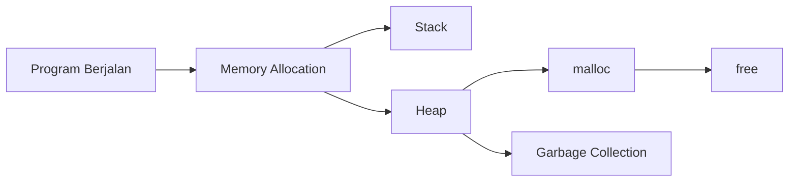

# Week 02 — Memory Management

---

# Ringkasan

Pada pertemuan kedua, saya mempelajari konsep dasar **Memory Management** yang merupakan salah satu aspek penting dalam pemrograman maupun Reverse Engineering. Materi berfokus pada bagaimana sebuah program mengalokasikan memori ketika sedang berjalan menggunakan fungsi `malloc()` pada bahasa C serta bagaimana bahasa Java mengelola memori secara otomatis melalui mekanisme **Garbage Collection**. Selain memahami cara kerja kedua pendekatan tersebut, saya juga mulai mengenal konsep **heap**, **memory leak**, dan pentingnya pengelolaan memori yang benar untuk menjaga stabilitas aplikasi.

---

# Pembahasan Materi

## 1. Apa itu Memory Management?

Memory Management adalah proses mengatur penggunaan memori selama program berjalan. Sistem operasi dan bahasa pemrograman bekerja sama agar setiap aplikasi memperoleh ruang memori yang cukup tanpa mengganggu aplikasi lain.

Secara umum, memori digunakan untuk menyimpan:

- Variabel
- Objek
- Fungsi
- Data sementara
- Struktur data

Pengelolaan memori yang baik akan membuat program berjalan lebih efisien dan mengurangi risiko terjadinya error maupun pemborosan sumber daya.

---

## 2. Alokasi Memori Dinamis dengan `malloc()`

Dalam bahasa C, programmer dapat mengalokasikan memori secara dinamis menggunakan fungsi `malloc()` yang terdapat pada library `<stdlib.h>`.

Contoh sederhana:

```c
#include <stdio.h>
#include <stdlib.h>

int main() {
    int *angka = (int *) malloc(sizeof(int));

    *angka = 10;

    printf("%d", *angka);

    free(angka);

    return 0;
}
```

Fungsi `malloc()` akan meminta sejumlah memori kepada sistem operasi sesuai ukuran yang dibutuhkan. Fungsi ini mengembalikan alamat memori (*pointer*) yang nantinya dapat digunakan oleh program.

Karena alokasi dilakukan secara manual, programmer juga bertanggung jawab untuk mengembalikan memori tersebut menggunakan fungsi `free()` setelah selesai digunakan.

---

## 3. Heap dan Stack

Selama program berjalan, memori umumnya terbagi menjadi beberapa bagian. Dua di antaranya adalah **Stack** dan **Heap**.

### Stack

Stack digunakan untuk menyimpan:

- Variabel lokal
- Parameter fungsi
- Return address

Karakteristik Stack:

- Dialokasikan secara otomatis.
- Sangat cepat.
- Ukurannya terbatas.
- Memori dibebaskan otomatis ketika fungsi selesai dijalankan.

---

### Heap

Heap digunakan untuk menyimpan data yang dialokasikan secara dinamis menggunakan `malloc()`.

Karakteristik Heap:

- Dialokasikan secara manual.
- Ukurannya lebih fleksibel.
- Harus dibebaskan menggunakan `free()`.
- Lebih lambat dibanding Stack.

Diagram sederhana:

```text
Program Memory

+----------------------+
|       Stack          |
|  Variabel Lokal      |
|  Function Call       |
+----------------------+

|                      |

+----------------------+
|       Heap           |
| malloc()             |
| Dynamic Object       |
+----------------------+
```

---

## 4. Memory Leak

Salah satu kesalahan yang sering terjadi pada bahasa C adalah **Memory Leak**.

Memory Leak terjadi ketika program sudah tidak menggunakan suatu memori, tetapi programmer lupa memanggil `free()`.

Contoh:

```c
int *data = malloc(sizeof(int));

data = NULL;
```

Pada contoh tersebut, alamat memori yang dialokasikan menjadi hilang tanpa pernah dibebaskan sehingga ruang memori tetap terpakai hingga program selesai berjalan.

Jika terjadi berulang kali, aplikasi dapat menggunakan memori secara berlebihan dan menyebabkan penurunan performa bahkan crash.

---

## 5. Garbage Collection pada Java

Berbeda dengan C, Java menggunakan mekanisme **Garbage Collection (GC)**.

Garbage Collector merupakan bagian dari Java Virtual Machine (JVM) yang bertugas mendeteksi objek yang sudah tidak lagi digunakan, kemudian membebaskan memorinya secara otomatis.

Diagram sederhananya:

```text
Object Dibuat
      │
      ▼
Digunakan Program
      │
      ▼
Sudah Tidak Direferensikan
      │
      ▼
Garbage Collector
      │
      ▼
Memory Dibebaskan
```

Dengan adanya Garbage Collection, programmer tidak perlu memanggil fungsi seperti `free()` secara manual.

---

## 6. Perbandingan Pengelolaan Memori

| Bahasa C | Java |
|-----------|------|
| Menggunakan `malloc()` | Menggunakan `new` |
| Harus memanggil `free()` | Dibersihkan oleh Garbage Collector |
| Programmer mengelola memori | JVM mengelola memori |
| Lebih fleksibel | Lebih mudah digunakan |
| Berisiko Memory Leak | Risiko Memory Leak lebih kecil |

Masing-masing pendekatan memiliki kelebihan dan kekurangan. Bahasa C memberikan kontrol penuh kepada programmer, sedangkan Java mengutamakan kemudahan dan keamanan pengelolaan memori.

---

# Relevansi dengan Reverse Engineering

Pemahaman mengenai Memory Management sangat penting dalam Reverse Engineering karena sebagian besar analisis program melibatkan pengamatan terhadap penggunaan memori.

Sebagai contoh:

- Mengetahui lokasi data penting di Heap.
- Memahami bagaimana objek dibuat dan dihapus.
- Mengidentifikasi Memory Leak.
- Menelusuri buffer yang menjadi target eksploitasi.
- Menganalisis perilaku malware ketika mengalokasikan memori.

Oleh karena itu, konsep Memory Management menjadi salah satu dasar sebelum mempelajari analisis program yang lebih kompleks.

---

# Diagram Hubungan Memory Management



---

# Insight Minggu Ini

Materi minggu ini membuat saya memahami bahwa penggunaan memori tidak hanya berpengaruh pada performa program, tetapi juga pada keamanan aplikasi. Kesalahan kecil seperti lupa membebaskan memori dapat menyebabkan Memory Leak yang berdampak pada kestabilan sistem. Saya juga mulai memahami mengapa bahasa pemrograman modern banyak menggunakan mekanisme pengelolaan memori otomatis untuk mengurangi kesalahan yang dilakukan programmer.

---

# Tools yang Dipelajari

- Compiler C (GCC)
- Java Virtual Machine (JVM)

---

# Referensi

1. https://www.petanikode.com/c-malloc/
2. https://www.ibm.com/id-id/think/topics/garbage-collection-java
3. Modul Waskita Amikom Reverse Engineering

---

# Refleksi Pembelajaran

## Apa yang Saya Pahami

Pada minggu ini saya memahami bahwa Memory Management merupakan proses penting dalam mengatur penggunaan memori selama program berjalan. Saya mengetahui bahwa bahasa C menggunakan pendekatan manual melalui fungsi `malloc()` dan `free()`, sedangkan Java menggunakan Garbage Collection untuk mengelola memori secara otomatis. Saya juga mulai memahami perbedaan fungsi Stack dan Heap serta dampaknya terhadap pengembangan perangkat lunak.

## Apa yang Masih Membingungkan

Saya masih ingin memahami bagaimana Garbage Collector menentukan objek yang benar-benar sudah tidak digunakan serta algoritma apa yang digunakan dalam proses tersebut. Selain itu, saya juga ingin mempelajari lebih lanjut bagaimana penggunaan Heap diamati ketika melakukan Dynamic Analysis terhadap suatu executable.

## Kesimpulan Pribadi

Materi mengenai Memory Management memberikan pemahaman bahwa pengelolaan memori merupakan bagian penting dalam pengembangan perangkat lunak sekaligus Reverse Engineering. Dengan memahami cara memori dialokasikan dan dibebaskan, saya dapat lebih mudah menganalisis perilaku suatu program ketika mempelajari executable maupun malware pada pertemuan-pertemuan berikutnya.

---
