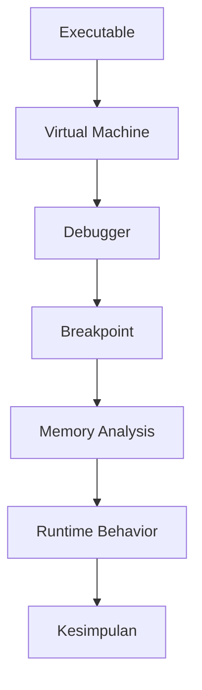

# Week 05 — Dynamic Analysis dalam Reverse Engineering

---

# Ringkasan

Pada pertemuan kelima, saya mempelajari **Dynamic Analysis**, yaitu metode analisis yang dilakukan dengan menjalankan program secara langsung untuk mengamati perilakunya pada saat runtime. Berbeda dengan Static Analysis yang hanya memeriksa struktur executable tanpa menjalankannya, Dynamic Analysis memungkinkan analis melihat bagaimana program berinteraksi dengan sistem operasi, memori, file, registry, maupun jaringan. Selain itu, saya juga mempelajari perbedaan antara analisis statis dan dinamis serta memahami bahwa kedua metode tersebut saling melengkapi dalam proses Reverse Engineering.

---

# Pembahasan Materi

## 1. Apa itu Dynamic Analysis?

Dynamic Analysis adalah proses menganalisis sebuah program ketika program tersebut sedang berjalan (*runtime*). Dengan menjalankan executable, analis dapat mengamati perilaku aktual program sehingga memperoleh informasi yang tidak dapat ditemukan hanya melalui Static Analysis.

Beberapa informasi yang dapat diperoleh melalui Dynamic Analysis antara lain:

- Alur eksekusi program.
- Perubahan isi memori.
- Aktivitas proses (*process*).
- Interaksi dengan file.
- Akses registry (Windows).
- Komunikasi jaringan.
- API yang dipanggil selama program berjalan.

Karena program benar-benar dijalankan, proses ini umumnya dilakukan di lingkungan yang aman seperti **Virtual Machine (VM)** atau **Sandbox**.

---

## 2. Mengapa Dynamic Analysis Penting?

Static Analysis mampu memberikan gambaran mengenai struktur program, tetapi tidak selalu menunjukkan bagaimana program benar-benar berperilaku ketika dijalankan.

Melalui Dynamic Analysis, analis dapat:

- Mengamati perilaku malware.
- Menemukan proses enkripsi atau dekripsi.
- Memahami komunikasi jaringan.
- Mengidentifikasi proses yang dibuat oleh aplikasi.
- Mengamati perubahan file maupun registry.

Dengan demikian, Dynamic Analysis menjadi pelengkap dari Static Analysis untuk memperoleh pemahaman yang lebih menyeluruh.

---

## 3. Runtime Behavior

Runtime Behavior adalah seluruh aktivitas yang dilakukan sebuah program setelah dijalankan.

Contohnya meliputi:

- Membuka file.
- Membuat file baru.
- Mengakses registry.
- Membuat koneksi internet.
- Mengalokasikan memori.
- Membuat proses baru.
- Memanggil library tertentu.

Semua aktivitas tersebut dapat diamati menggunakan berbagai tools monitoring.

---

## 4. Debugger

Debugger merupakan tools utama dalam Dynamic Analysis yang memungkinkan analis mengendalikan jalannya program.

Debugger memiliki berbagai fungsi, seperti:

- Menjalankan program langkah demi langkah (*Step Into* dan *Step Over*).
- Menghentikan program pada titik tertentu (*Breakpoint*).
- Mengamati isi register CPU.
- Memeriksa isi memori.
- Melihat Call Stack.
- Memodifikasi nilai variabel selama program berjalan.

Beberapa debugger yang sering digunakan:

- x64dbg
- OllyDbg
- WinDbg
- GDB (Linux)

---

## 5. Breakpoint

Breakpoint merupakan titik berhenti sementara ketika program dijalankan.

Dengan menggunakan breakpoint, analis dapat:

- Menghentikan program sebelum instruksi tertentu dieksekusi.
- Memeriksa isi register.
- Mengamati perubahan memori.
- Mengetahui urutan eksekusi program.

Contoh sederhana:

```text
Program Start

↓

Login()

↓

[Breakpoint]

↓

Verifikasi Password

↓

Dashboard
```

Breakpoint sangat membantu ketika ingin mengetahui bagaimana suatu fungsi bekerja.

---

## 6. Register dan Memory

Saat melakukan debugging, analis juga dapat melihat isi register CPU.

Beberapa register yang umum dijumpai pada arsitektur x86/x64 antara lain:

| Register | Fungsi |
|----------|--------|
| RAX / EAX | Menyimpan hasil operasi |
| RBX / EBX | General Purpose |
| RCX / ECX | Counter |
| RDX / EDX | Data Register |
| RSP | Stack Pointer |
| RBP | Base Pointer |
| RIP | Instruction Pointer |

Selain register, analis juga dapat mengamati perubahan data di dalam memori sehingga dapat mengetahui bagaimana program mengolah informasi selama berjalan.

---

## 7. Process Monitoring

Dynamic Analysis juga melibatkan pemantauan proses yang dijalankan oleh executable.

Informasi yang biasanya diamati meliputi:

- Process ID (PID)
- Parent Process
- Child Process
- Thread
- CPU Usage
- Memory Usage

Monitoring proses sangat membantu ketika menganalisis malware yang membuat proses baru secara otomatis.

---

## 8. Perbandingan Static Analysis dan Dynamic Analysis

| Static Analysis | Dynamic Analysis |
|-----------------|------------------|
| Tidak menjalankan program | Menjalankan program |
| Lebih aman | Memiliki risiko jika dilakukan tanpa isolasi |
| Menganalisis struktur executable | Menganalisis perilaku runtime |
| Cepat memperoleh informasi awal | Memberikan gambaran perilaku sebenarnya |
| Tidak dapat melihat aktivitas runtime | Dapat melihat aktivitas runtime secara langsung |

Kedua metode memiliki kelebihan dan kekurangan masing-masing sehingga biasanya digunakan secara bersamaan dalam proses Reverse Engineering.

---

# Workflow Dynamic Analysis

```text
Executable

↓

Virtual Machine

↓

Debugger

↓

Breakpoint

↓

Observasi Memory

↓

Analisis Perilaku

↓

Kesimpulan
```

---

# Diagram Dynamic Analysis



---

# Relevansi dalam Reverse Engineering

Dynamic Analysis memiliki peran penting karena memungkinkan analis mengamati bagaimana sebuah executable benar-benar bekerja ketika dijalankan. Banyak malware modern menggunakan teknik seperti packing, encryption, atau obfuscation sehingga informasi penting baru akan muncul saat program dieksekusi. Dengan melakukan Dynamic Analysis, analis dapat memahami perilaku aktual program dan mengidentifikasi aktivitas yang mungkin berbahaya.

---

# Tools yang Dipelajari

- x64dbg
- OllyDbg
- WinDbg
- Process Monitor (Procmon)
- Process Explorer
- Wireshark
- VMware Workstation
- Oracle VirtualBox

---

# Insight Minggu Ini

Materi minggu ini membuat saya memahami bahwa melihat struktur program saja belum cukup untuk mengetahui cara kerjanya secara keseluruhan. Dengan menjalankan program menggunakan debugger, saya dapat mengamati bagaimana executable berinteraksi dengan sistem operasi, memori, maupun jaringan. Saya juga menyadari bahwa Static Analysis dan Dynamic Analysis bukanlah dua metode yang saling menggantikan, tetapi saling melengkapi untuk memperoleh hasil analisis yang lebih akurat.

---

# Referensi

1. Modul Praktikum Reverse Engineering
2. x64dbg Documentation
3. Microsoft WinDbg Documentation
4. Sysinternals Process Monitor Documentation
5. Oracle VirtualBox Documentation

---

# Refleksi Pembelajaran

## Apa yang Saya Pahami

Pada minggu ini saya memahami bahwa Dynamic Analysis dilakukan dengan menjalankan executable untuk mengamati perilaku program secara langsung. Saya mengetahui bahwa debugger merupakan tools utama dalam proses ini karena memungkinkan analis menghentikan program menggunakan breakpoint, memeriksa isi register, serta mengamati perubahan memori selama runtime. Selain itu, saya juga memahami bahwa Dynamic Analysis mampu mengungkap informasi yang tidak dapat diperoleh melalui Static Analysis.

## Apa yang Masih Membingungkan

Saya masih ingin mempelajari teknik debugging yang lebih lanjut, seperti penggunaan conditional breakpoint, memory breakpoint, dan API hooking. Selain itu, saya juga ingin memahami bagaimana malware modern dapat mendeteksi keberadaan debugger (*anti-debugging*) dan teknik yang digunakan analis untuk mengatasinya.

## Kesimpulan Pribadi

Materi mengenai Dynamic Analysis memberikan pemahaman bahwa perilaku suatu program hanya dapat diamati secara menyeluruh ketika program tersebut dijalankan. Dengan menggabungkan hasil Static Analysis dan Dynamic Analysis, seorang Reverse Engineer dapat memperoleh gambaran yang lebih lengkap mengenai cara kerja executable, sehingga proses analisis menjadi lebih akurat dan efektif.

---